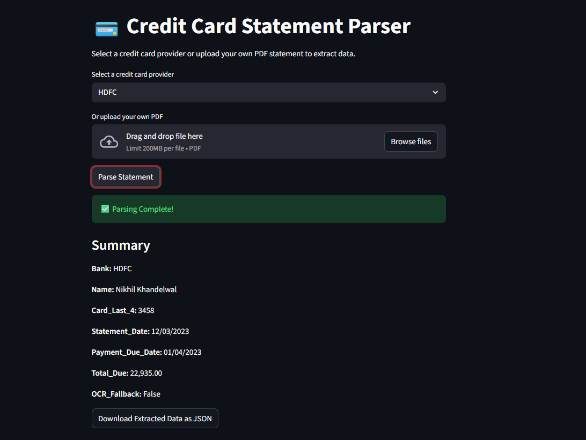
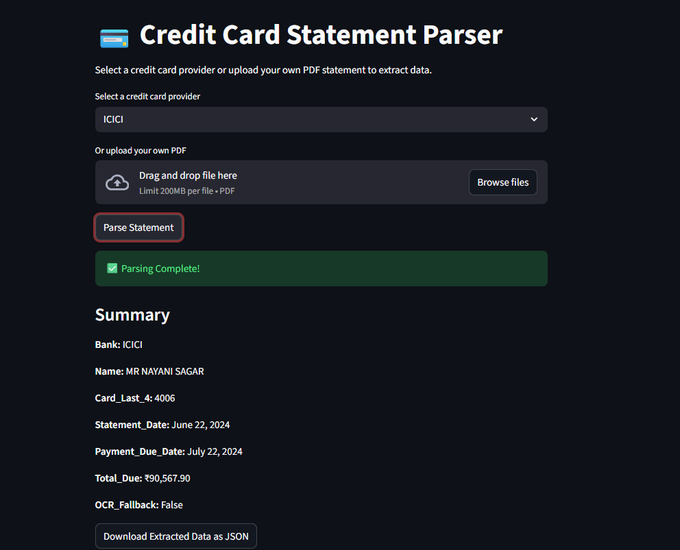
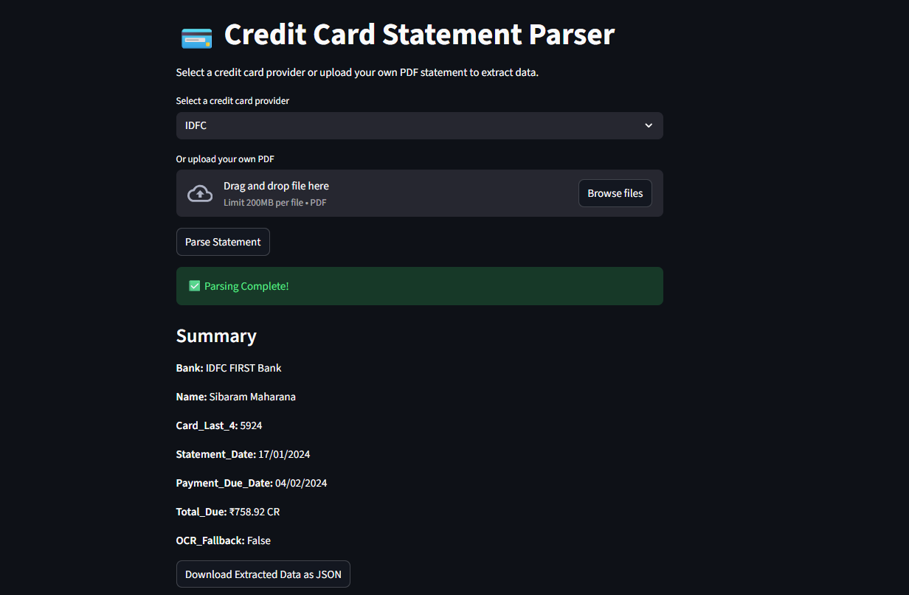
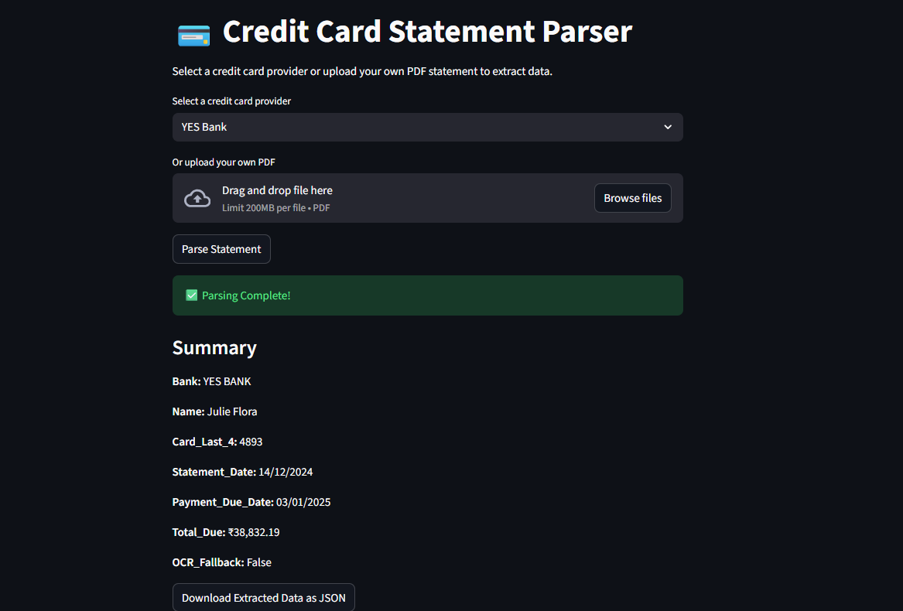
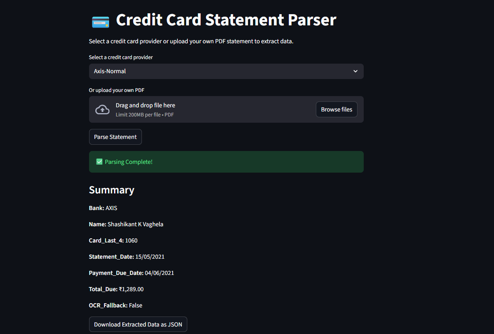
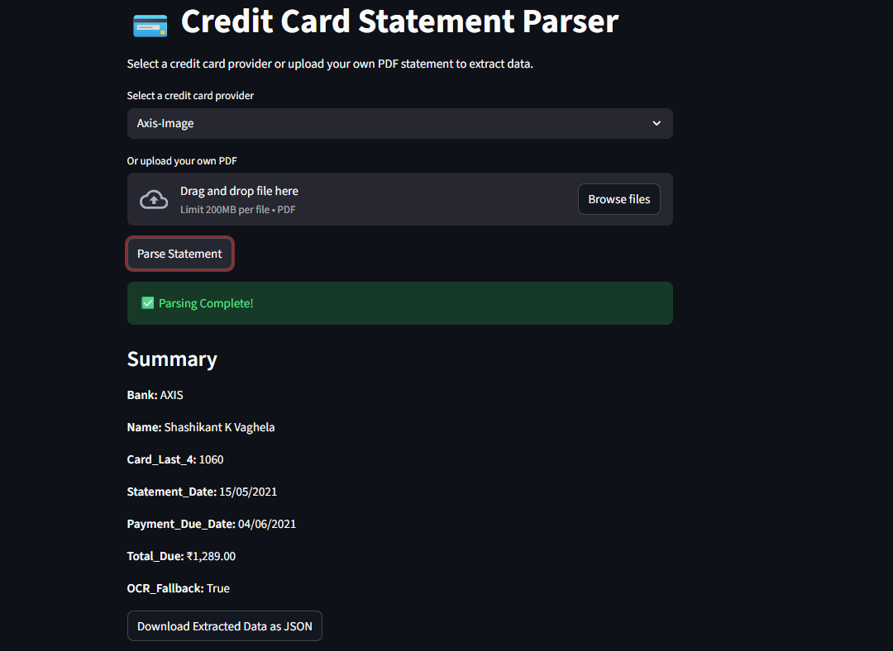

# 💳 Credit Card Statement Parser

Parse and extract details from credit card PDF statements (HDFC, ICICI, Axis, YES Bank, IDFC) with optional OCR fallback.

## Features

- Extract **Name, Card last 4 digits, Statement Date, Payment Due Date, Total Due**
- **OCR fallback** for scanned PDFs: If the PDF contains no selectable text, the app automatically uses Tesseract OCR to extract data.
- Download parsed data as **JSON**
- Streamlit web UI for easy interaction
- Supports PDFs from multiple banks:
  - HDFC
  - ICICI
  - Axis (normal & image PDFs)
  - YES Bank
  - IDFC

## Setup

1.  Clone the repo:
    ```bash
    git clone HarshalShah_70022200106_surefirst-credit-card-parser
    cd credit-card-parser
    ```
2.  Install dependencies:
    ```bash
    pip install -r requirements.txt
    ```
3.  Ensure Tesseract is installed:
    * **Windows:** `C:\Program Files\Tesseract-OCR\tesseract.exe`
    * **Linux/Mac:** Install via package manager and update `pytesseract.pytesseract.tesseract_cmd` in `all_bank_parser.py` if needed

*Tested on Python 3.12.3 and Windows 11*

## Usage

### Streamlit Web App

1.  Run the app:
    ```bash
    streamlit run app.py
    ```
2.  Select a credit card provider from the dropdown or upload your own PDF.
3.  Click "Parse Statement".
4.  View summary and download extracted data as JSON.

### CLI Parser

1.  ```bash
    python main.py
    ```
2.  Enter the PDF filename (from `credit_card_pdfs/` folder or your own PDF)
3.  Extracted data will be printed in JSON format.

## Sample PDFs

All sample PDFs are in the `credit_card_pdfs/` folder. You can upload your own PDF in the app.

* HDFC
* ICICI
* Axis (Normal & Image)
* YES Bank
* IDFC

## Project Structure
```
credit-card-parser/
├── parser/
│   └── all_bank_parser.py
├── credit_card_pdfs/
│   ├── hdfc.pdf
│   ├── icici.pdf
│   └── ...
├── Pictures/
│   ├── hdfc.png
│   ├── icici.png
│   └── ...
├── app.py
├── main.py
├── requirements.txt
└── README.md
```

## Screenshots
# HDFC 


# ICICI


# IDFC


# YES-BANK 


# AXIS-Normal


# AXIS-Image

